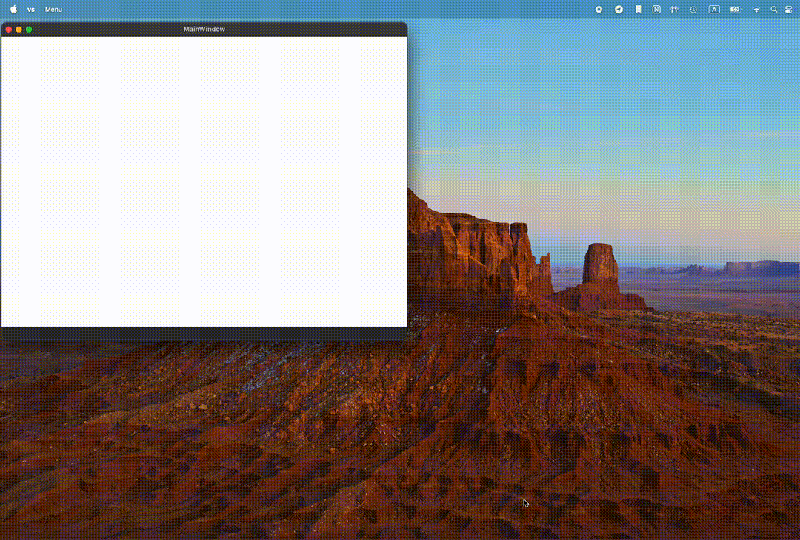

## Demo

## Brief comments

In this app, the user can upload a text file and I will build a [Huffman Tree](https://en.wikipedia.org/wiki/Huffman_coding) for them. Since drawing a tree in a fixed amount of space can cause text to overlap, I provide a scrollable area where the tree is displayed clearly. The user can also hover over any character to see its Huffman encoding.

## Future plans

- Add tabs so the user can work with many texts at the same time.
- Show Metadata, such as rate of compression.
- Improve the design of the Tree
