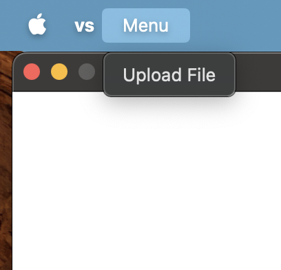
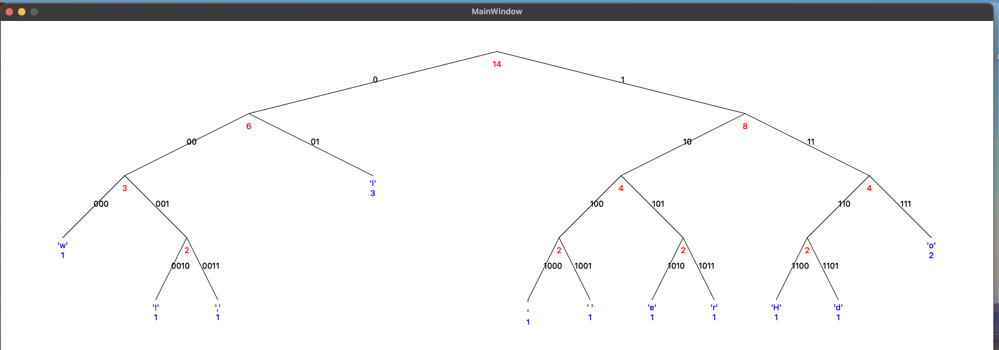

This project is here to help with the visualization of the [Huffman Tree](https://en.wikipedia.org/wiki/Huffman_coding) for a certain text.

_A user can see the Upload File button by pressing the menu._

_A user can choose any text file from the file system._

_After you press open the app draws Huffman Tree specific to the your provided text. In the example above phrase "Hello World" is encoded. You can choose a different file at any time, and the app will redraw the tree._
